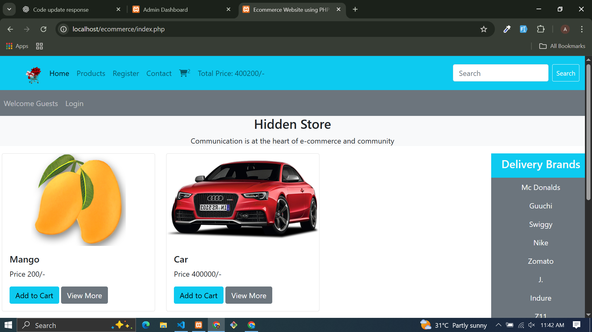

# 🛒 PHP eCommerce Website  

This is a **responsive eCommerce Website** built with **PHP & MySQL** and **Bootstrap 5**.  
It includes features like product management, categories, brands, cart, checkout, and user authentication.  

---

## 📸 Preview  
  

---

## 🚀 Features  
- Responsive design (Desktop, Tablet, Mobile)  
- User Registration & Login System  
- Add to Cart & Checkout  
- Product Management (Insert, Edit, Delete)  
- Categories & Brands Management  
- Orders & Payment Tracking  
- Admin Dashboard for managing the store  

---

## 🛠️ Tech Stack  
- **Frontend:** HTML5, CSS3, Bootstrap 5, JavaScript  
- **Backend:** PHP (Core PHP, no framework)  
- **Database:** MySQL  
- **Icons:** Font Awesome 6  

---

## 📂 Project Structure  
php-ecommerce-website/  
│── admin_area/  
│── includes/  
│── functions/  
│── user_area/  
│── assets/  
│   ├── css/  
│   ├── js/  
│   ├── images/  
│── index.php  
│── cart.php  
│── display_all.php  
│── product_details.php  
│── search_product.php  
│── README.md  

---

## 👨‍💻 Author  
- Attiq Ur Rehman  
  [GitHub Profile](https://github.com/attiq-ur-rehman4855)  
